# AsRock-Z690-Steel-Legend-i5-13600K
## 主要配置

| 组件 | 名称                                           |
| ---- | ---------------------------------------------- |
| CPU  | i5-13600K                                      |
| 主板 | 华擎 AsRock Z690 Steel Legend 钢铁传奇 WiFi 6E |
| 显卡 | NVIDIA RTX 2080Ti 11GB + AMD RX 570 8GB        |
| 硬盘 | 爱国者 P7000Z PCie4.0 2TB                      |
| 机型 | MacPro7,1                                      |
| 网卡 | Intel AX210 + BCM94360CD                       |

- 自带的 Intel Wi-Fi 6E 网卡其实也可以驱动，但是完美度不如 BCM 网卡 所以我们选择不驱动它
- 爱国者 P7000Z PCIe 4.0 是一个性价比很高的固态硬盘，黑苹果下表现也不错 
  - 但是可惜和华擎兼容性不太好，可能出现掉盘现象 
  - 目前我的第一插槽就掉盘了2次，不过其他的槽目前工作良好
  - 当然也可能确实是硬盘的问题，总之给大家打个预防针
- i5-13600K 超频能力很强 不搭配水冷或者不搭配 Z系列主板，很难发挥出它的真正实力

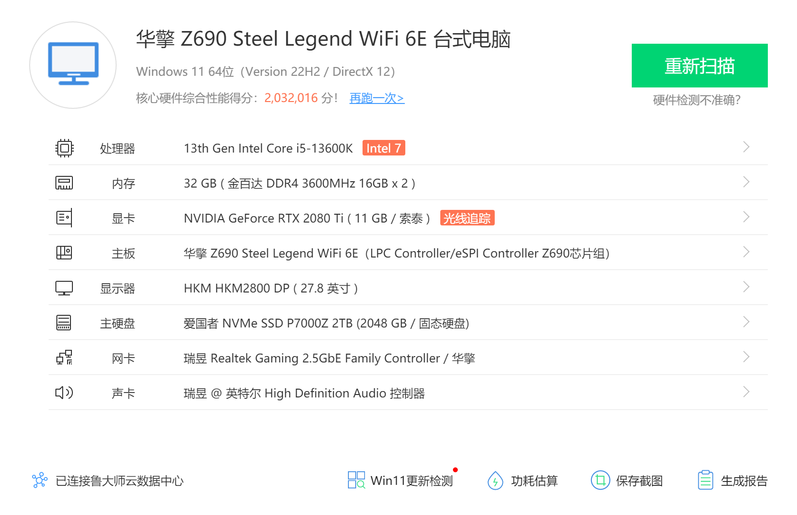

## BIOS 设置

只黑苹果的话「华擎 AsRock Z690 Steel Legend 钢铁传奇」主板 BISO 主要调整如下：

- 「高级」-「CPU 配置」-「Intel Hyper Threading Technology」-「开启」
- 「高级」-「CPU 配置」-「CFG Lock」-「关闭」
- 「高级」-「CPU 配置」-「Software Guard Extensions（SGX）」-「关闭」
- 「高级」-「芯片组配置」-「Above 4G Decoding」-「启用」
- 「高级」-「芯片组配置」-「VT-d」-「禁用」
- 「高级」-「芯片组配置」-「共享内存」-「64MB」
- 「高级」-「芯片组配置」-「IGPUA 多监视器」-「启用」
- 「高级」-「芯片组配置」-「深度睡眠」-「在 S4-S5 中启用」
- 「高级」-「存储 配置」-「SATA 模式选择」-「AHCI」
- 「高级」-「Intel(R) Thunderbolt」-「Discrete Thunderbolt(TM) Support」-「关闭」
- 「高级」-「ACPI 配置」-「挂起到内存」-「自动」
- 「高级」-「ACPI 配置」-「USB 键盘/远程开机」-「Disabled」
- 「高级」-「ACPI 配置」-「USB 鼠标开机」-「Disabled」
- 「高级」-「USB 配置」-「XHCI Hand-off」-「Enabled」
- 「安全」-「Secure Boot」-「安全引导」-「关闭」
- 「安全」-「Intel(R) Platform Trust Technology」-「禁用」
- 「引导」-「闪速启动」-「关闭」
- 「引导」-「CSM」-「关闭」

---

如果超频 CPU 的话，根据我的 CPU 体制，主要 BIOS 调整如下：

- 「超频工具」-「CPU Core Compensation」-「级别1」
- 「超频工具」-「CPU Cooler Type」-「240-280mm 水冷」
- 「超频工具」-「Base Frequency Boost」-「265W」
- 「超频工具」-「CPU 配置」
  - CPU P - Core 「每个内核」：58-56-54-54-54-54
    - 指的是大核心单核超频 5.8Ghz，2 核工作的频率为 5.6Ghz，其余核同时工作的频率为 5.4Ghz
  - CPU E - Core 「所有内核」：45
    - 指的所有小核心都以 4.5Ghz 工作
  - 「Boot Performance Mode」-「Turbo Performance」
  - 「长时间功耗限制」-「300.00」
  - 「长时间维持」-「224s」
  - 「长时间维持」-「300.00」
- 「超频工具」-「电压配置」
  - 「Voltage Mode」-「OC Mode」
  - 「CPU Core/Cache Voltage」-「固定模式」
  - 「固定电压」-「1.355v」
  - 「CPU 防掉压设定」-「级别 1」
  - 「CPU GT 防掉压设定」-「级别 3」
  - 「IA AC Loadline」-「0.01」
  - 「IA DC Loadline」-「0.01」

最终 Windows 下的测试成绩：

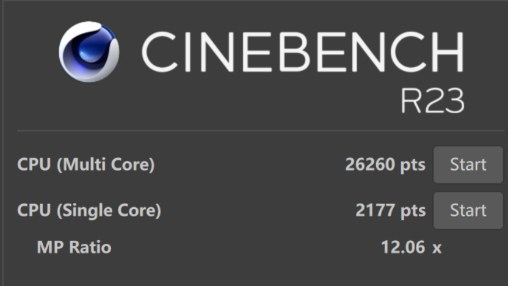 

 单核已经超过了 i9-12900K，多核也是五五开的水平：

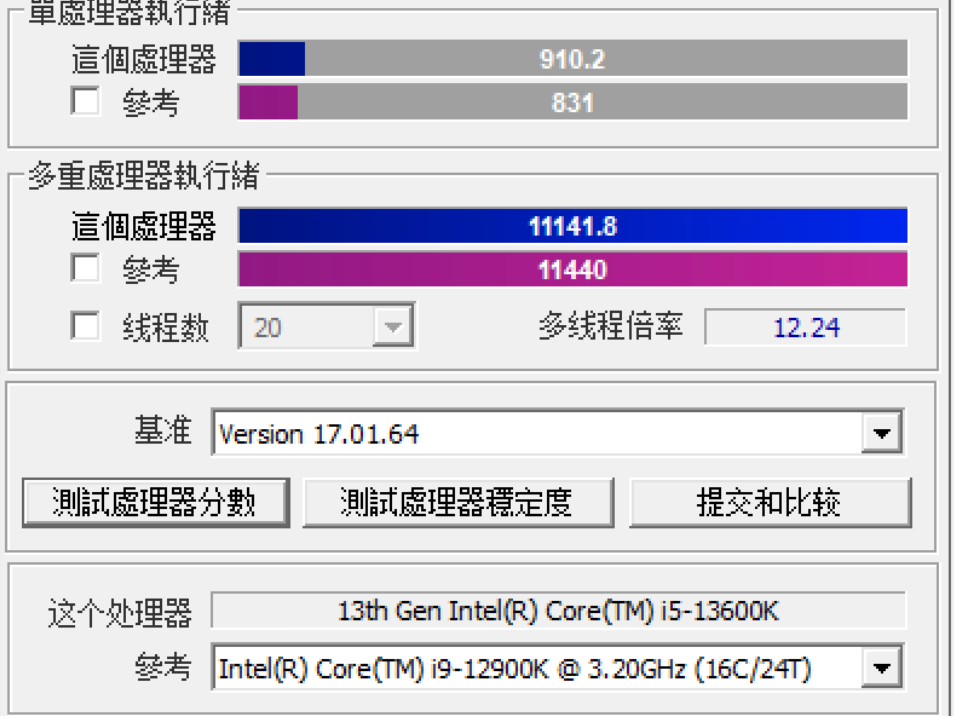 

---

如果超频内存的话，根据我的金百达黑爵 16GB x 2 3600Mhz 18-22-22-44 1.35V 内存体制，这里不再啰嗦内存超频细节了，反正也比较简单就是设置好时序，频率以及内存电压即可，最终我的内存成绩为：

DDR4 4000MHz 1.38V C18-21-21-42 延迟 57.7NS


## macOS Ventura 13.X

5.8Gh 的频率看着真爽呀：

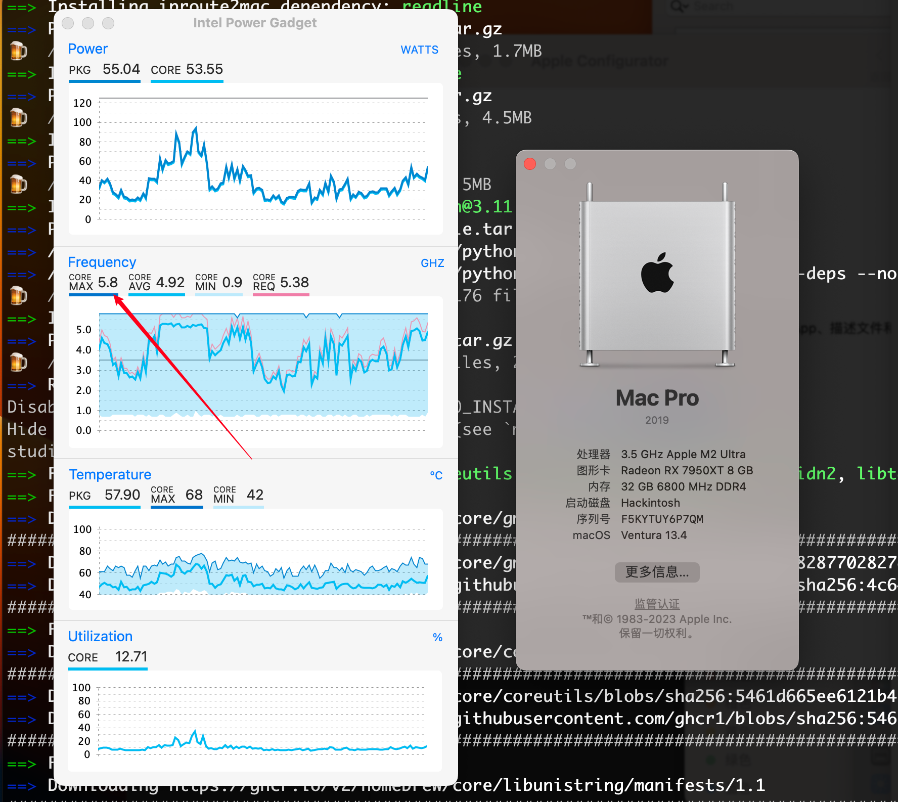 

PS：图上的 CPU 型号、显卡型号还有内存频率都是国光我自定义修改哈，图一乐。

macOS 下超频状态的 Geekbench 跑分如下：

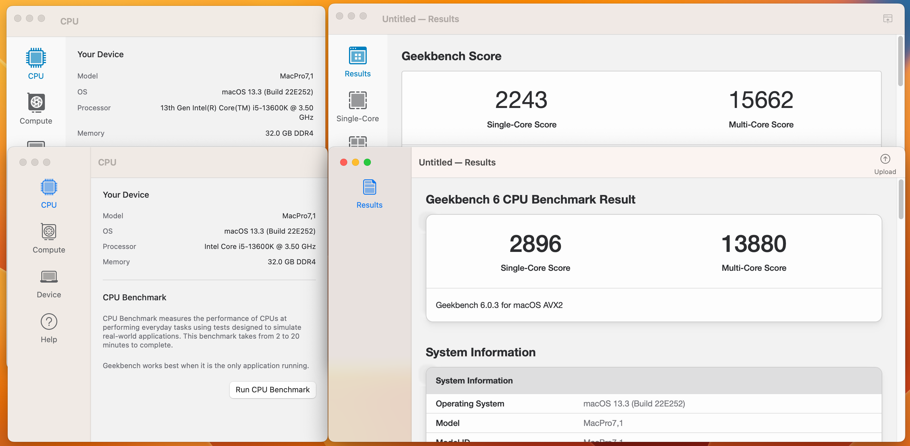 

R23 的跑分也还不错，和 Windows 下相比几乎没啥损耗：

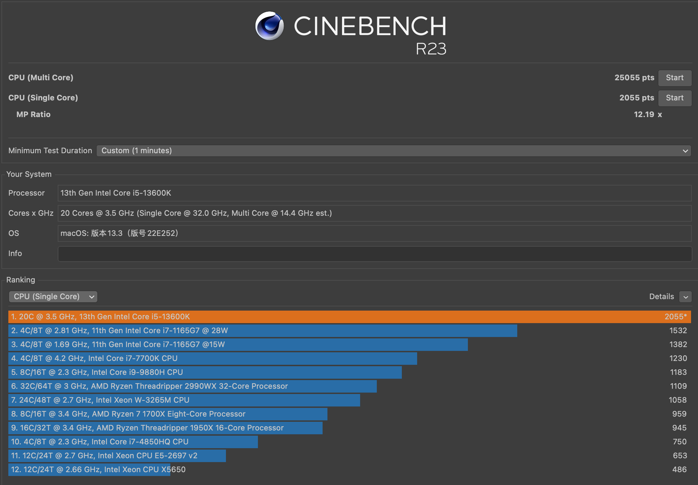

实际测试在 macOS 下的大小核调度还算是不错的，全核跑分的情况下，20 核心通过观察都是可是跑满的：

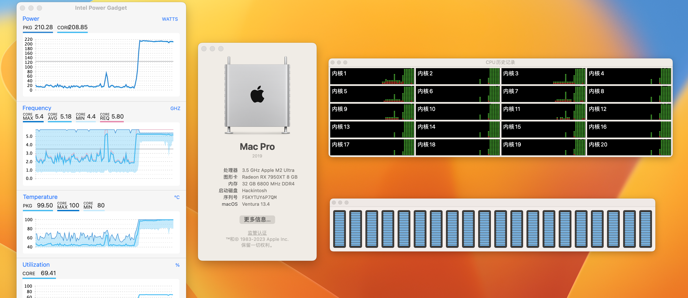 

所以 macOS 下的跑分和 Windows 几乎是没啥差别的。

此外这个 aigo P7000Z 的读写速度确实很快呀，这会让日常使用体验更加丝滑：

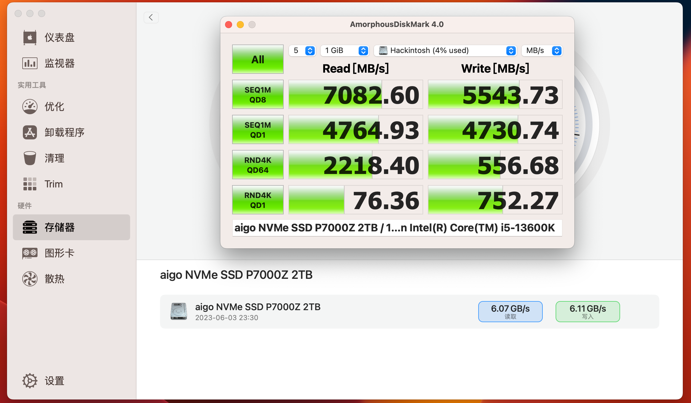 

另外通过 @**乌龙蜜桃来一打** 分享 macOS 13 USB 解锁补丁） ，也可以定制超过 15 个端口数量的 USB 接口：

```xml
<dict>
				<key>Arch</key>
				<string>Any</string>
				<key>Base</key>
				<string></string>
				<key>Comment</key>
				<string>USB All Port</string>
				<key>Count</key>
				<integer>0</integer>
				<key>Enabled</key>
				<true/>
				<key>Find</key>
				<data>QYPlD0HT5UQJ6w==</data>
				<key>Identifier</key>
				<string>com.apple.iokit.IOUSBHostFamily</string>
				<key>Limit</key>
				<integer>0</integer>
				<key>Mask</key>
				<data></data>
				<key>MaxKernel</key>
				<string></string>
				<key>MinKernel</key>
				<string>22.0.0</string>
				<key>Replace</key>
				<data>QYPlP0HT5UQJ6w==</data>
				<key>ReplaceMask</key>
				<data></data>
				<key>Skip</key>
				<integer>0</integer>
			</dict>
```

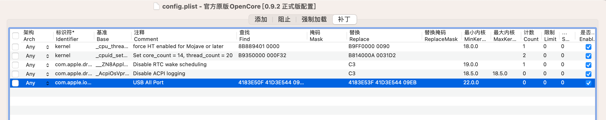

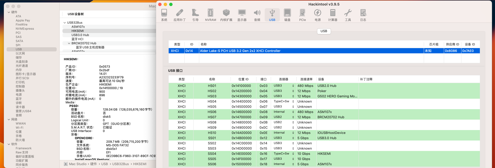 

因为 N 卡无法驱动，使用 OC 设备属性里面直接添加 `disable-gpu = YES` 也可以直接屏蔽 N 卡：

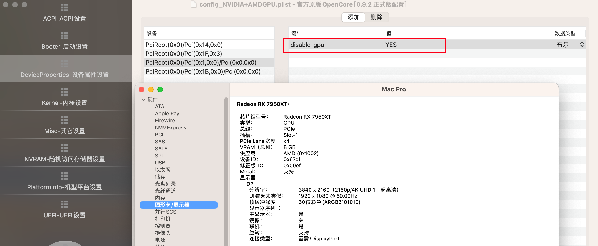 

**系统只是工具，我们要学会使用系统去创造价值，而不是沉迷如何安装系统上，这句话也送给大家。最后祝你使用愉快！**

## 支持一下

因为黑苹果驱动定制是很耗费时间的事情，为了追求完美需要各种优化，生活不易，猫猫叹气，如果你恰巧财力雄厚的话，可以考虑打赏下本文哦，打赏情况国光我也会同步更新我的打赏列表的：[打赏列表 | 国光](https://www.sqlsec.com/reward/) 

<table>
    <tr>
        <td>
            <center></center>
        </td>
        <td width="50%">
            <center></center>
        </td>
    </tr>
</table>

